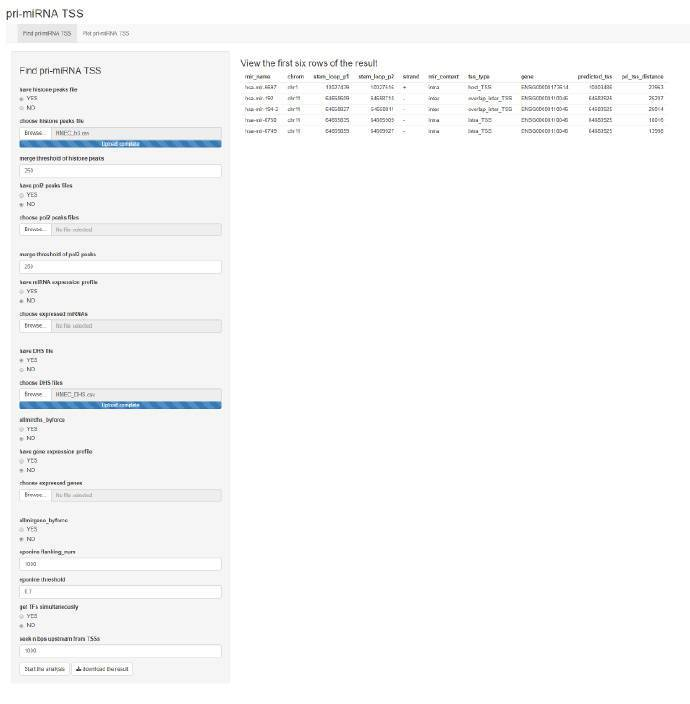
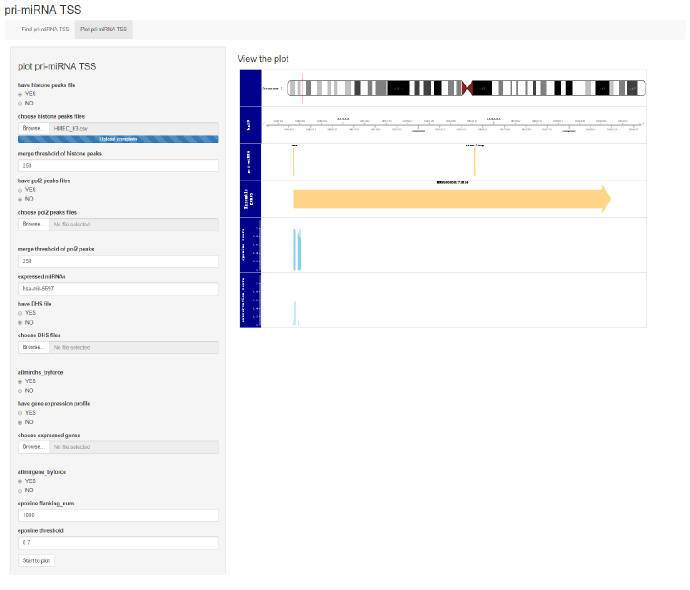

```{r setup, include = FALSE}
knitr::opts_chunk$set(
  collapse = TRUE,
  comment = "#>"
)
```

## 1 Introduction
Identifying human miRNA transcriptional start sites (TSSs) plays a significant 
role in understanding the transcriptional regulation of miRNA. However, due to 
the quick capping of pri-miRNA and many miRNA genes may lie in the introns or 
even exons of other genes, it is difficult to detect miRNA TSSs. miRNA TSSs are 
cell-specific. And miRNA TSSs are cell-specific, which implies the same miRNA in 
different cell-lines may start transcribing at different TSSs.

High throughput sequencing, like ChIP-seq, has gradually become an essential and 
versatile approach for us to identify and understand genomes and their 
transcriptional processes. 
By integrating H3k4me4 and Pol II data, parting of false positive counts 
after scoring can be filtered out. Besides, DNase I hypersensitive sites(DHS) also
imply TSSs, where miRNAs will be accessible and functionally related to 
transcription activities. And additionally, the expression profile of miRNA and 
genes in certain cell-line will be considered as well to improve fidelity. By 
employing all these different kinds of data, here we have developed the primirTSS 
package to assist users to identify miRNA TSSs in human and to provide them with 
related information about where miRNA genes lie in the genome, with both 
command-line and graphical interfaces.


## 2 Find the best putative TSS

### Installation

#### 1 primirTSS

Install the latest release of R, then get `primirTSS` by starting R and entering 
the commands:

```{r, eval = FALSE}
if (!requireNamespace("BiocManager", quietly = TRUE))
    install.packages("BiocManager")
BiocManager::install("primirTSS")
```

Or install the development version of the package using the same command, 
but with GitHub account name.

```{r, eval = FALSE}
BiocManager::install("ipumin/primirTSS")
```

#### 2 Install Java SE Development Kit(JDK)
As Java development environment is indispensable for the primary function in our 
package, it is <span style="border-bottom:1px dashed black;">necessary</span> 
for users to install [Java SE Development Kit 10](http://www.oracle.com/technetwork/java/javase/downloads/jdk10-downloads-4416644.html) 
before using `primirTSS`. 

#### 3 Load the package into R session

```{r Load, message=FALSE}
library(primirTSS)
```


## 3 Getting Started

### Step 1: Process of H3K4me3 and Pol II data

* `peak_merge()`: **Merge one kind of peaks** (H3K4me3 **or** Pol II)

**H3K4me3** and **Pol II** data are key points for accurate prediction with our method. 
If one of these two peak data is input, before executing the main function `find_TSS`, 
the function `peak_merge` should be used to merge adjacent peaks whose distance 
between each other is less than `n` base pairs and return the merged peaks as an 
output.

```{r}
library(primirTSS)
peak_df <- data.frame(chrom = c("chr1", "chr2", "chr1"),
                       chromStart = c(450, 460, 680),
                       chromEnd = c(470, 480, 710),
                       stringsAsFactors = FALSE)
peak <-  as(peak_df, "GRanges")
peak_merge(peak, n =250)
```

</br>

* `peak_join()`: **Join two kinds of peaks** (H3K4me3 **and** Pol II)
 
If both of H3K4me3 and Pol II data, after separately merging these two kinds of
evidence first, `peak_join` should be employed to integrate H3K4me3 and Pol II peaks
and return the result as `bed_merged` parameter for the main function `find_tss`.

```{r}
peak_df1 <- data.frame(chrom = c("chr1", "chr1", "chr1", "chr2"),
                       start = c(100, 460, 600, 70),
                       end = c(200, 500, 630, 100),
                       stringsAsFactors = FALSE)
peak1 <-  as(peak_df1, "GRanges")

peak_df2 <- data.frame(chrom = c("chr1", "chr1", "chr1", "chr2"),
                       start = c(160, 470, 640, 71),
                       end = c(210, 480, 700, 90),
                       stringsAsFactors = FALSE)
peak2 <-  as(peak_df2, "GRanges")

peak_join(peak1, peak2)
```

### Step 2: Predict most possible TSS for miRNA


* `find_tss` is the primary function in the package. The program will first score 
the candidate TSSs of miRNA and pick up the best candidate in the first step of 
prediction, (where users can set `flanking_num` and `threshold`). 
* After the first step, H3K4me3 and Pol II data, miRNA expression profiles and
DHS check, protein-coding genes expression profiles, if provided, will be 
integrated to decrease the rate of false positive.

</br>
</br>

There will be different circumstances where not all miRNA expression profiles, 
DHS data, protein-coding gene('gene') expression profiles are available:

</br>

**Circumstance 1:** no miRNA expression data; then suggest DHS check and 
protein-coding gene check.

* `ignore_DHS_check`: If users do not have their own miRNA expression profile, 
the function will employ all the miRNAs already annotated in human, but we 
suggest using DHS data of the cell line from **ENCODE** to check whether this
miRNA is expressed in the cell line or not as well as and all human gene expression 
profiles from **Ensemble** to check the relative position of TSSs and 
protein-coding genes to improve the accuracy of prediction.


```{r}
peakfile <- system.file("testdata", "HMEC_h3.csv", package = "primirTSS")
DHSfile <- system.file("testdata", "HMEC_DHS.csv", package = "primirTSS")
peak_h3 <- read.csv(peakfile, stringsAsFactors = FALSE)
DHS <- read.csv(DHSfile, stringsAsFactors = FALSE)
DHS <- as(DHS, "GRanges")
peak_h3 <-  as(peak_h3, "GRanges")
peak <- peak_merge(peak_h3)
```
```
no_ownmiRNA <- find_tss(peak, ignore_DHS_check = FALSE,
                        DHS = DHS, allmirdhs_byforce = FALSE,
                        expressed_gene = "all",
                        allmirgene_byforce = FALSE,
                        seek_tf = FALSE)
```

</br>

**Circumstance 2**: miRNA expression data provided; then no need for DHS check 
but protein-coding gene check.

* `expressed_mir`: If users have their own miRNA expression profiles, we will use 
the expressed miRNAs and we suggest not using DHS data of the cell line or others 
to check the expression of miRNAs.But the protein-coding gene check to check the 
relative position of TSSs and protein-coding genes is necessary, which helps to
verify the precision of prediction.

```{r}
bed_merged <- data.frame(
                chrom = c("chr1", "chr1", "chr1", "chr1", "chr2"),
                start = c(9910686, 9942202, 9996940, 10032962, 9830615),
                end = c(9911113, 9944469, 9998065, 10035458, 9917994),
                stringsAsFactors = FALSE)
bed_merged <- as(bed_merged, "GRanges")

expressed_mir <- c("hsa-mir-5697")

ownmiRNA <- find_tss(bed_merged, expressed_mir = expressed_mir,
                     ignore_DHS_check = TRUE,
                     expressed_gene = "all",
                     allmirgene_byforce = TRUE,
                     seek_tf = FALSE)
```

</br>

* `expressed_gene`: Additionally, users can also specify certain genes expressed
in the cell-line being analyzed:


### Step 3: Searching for TFs
* `seek_tf = TRUE`: If user want to predict transcriptional regulation 
relationship between TF and miRNA, like which TFs might regulate miRNA after get 
TSSs, they can change `seek_tf = FALSE` from `seek_tf = TRUE` directly in the 
comprehensive function `find_TSS()`. 


### Step4: Analysis of results 


Here is a demo of predicting TSS for hsa-mir-5697, ignore DHS check.


</br>

**PART1**, `$tss_df`:

```{r}
ownmiRNA$tss_df
```


The first part of the result returns details of predicted TSSs, composed of 
seven columns: 
*mir\_name, chrom, stem\_loop\_p1, stem\_loop\_p2, strand mir\_context, tss\_type gene* 
and *predicted_tss*:

 Entry|Implication
 :----:|----
 **mir_name**| Name of miRNA.
 **chrom** | Chromosome.
 **stem\_loop_p1**| The start site of a stem-loop.
 **stem\_loop_p2**| The end site of a stem-loop.
 **strand**|Polynucleotide strands. (`+/-`)
 **mir_context**|2 types of relative position relationship between stem-loop and protein-coding gene. (`intra/inter`)
 **tss_type**|4 types of predicted TSSs. See the section below TSS types for details.(`host_TSS/intra_TSS/overlap_inter_TSS/inter_TSS`)
 **gene**|Ensembl gene ID.
 **predicted_tss**| Predicted transcription start sites(TSSs).
 **pri\_tss_distance**|The distance between a predicted TSS and the start site of the stem-loop.
 
 
TSSs are cataloged into 4 types as below:

 * **host_TSS**: The TSSs of miRNA that are close to the TSS of protein-coding gene
  implying they may share the same TSS,
  on the condition where `mir_context = intra`.
  (See above: `mir_context`)

 * **intra_TSS:** The TSSs of miRNA that are NOT close to the TSS of protein-coding gene,
  on the condition where `mir_context = intra`.

 * **overlap\_inter_TSS:** The TSSs of miRNA are cataloged as `overlap_inter_TSS` 
 when the pri-miRNA gene overlaps with Ensembl gene, on the condition where "`mir_context = inter`".
  
 * **inter\_inter_TSS:** The TSSs of miRNA are cataloged as `inter_inter_TSS`
  when the miRNA gene does NOT overlap with Ensembl gene,
  on the condition where "`mir_context = inter`".

  (See [Xu HUA et al](https://academic.oup.com/bioinformatics/article-lookup/doi/10.1093/bioinformatics/btw171) 2016 for more details)


</br>


**PART2**, `$log`:

The second part of the result returns **4 logs** created during the process of prediction:

* **`find_nearest_peak_log`**:
  If no peaks locate in the upstream of
  a stem-loop to help determine putative TSSs of miRNA,
  we will fail to find the nearest peak,
  and this miRNA will be logged in `find_nearest_peak_log`.

 * **`eponine_score_log`**:
  For a certain miRNA, if none of the candidate TSSs scored with
Eponine method meet the threshold we set,
  we will fail to get an eponine score,
  and this miRNA will be logged in `eponine_score_log`.

 * **`DHS_check_log`**:
  For a certain miRNA, if no DHS signals locate
  within 1 kb upstream of each putative TSSs,
  these putative TSSs will be filtered out,
  and this miRNA will be logged in `DHS_check_log`.

 * **`gene_filter_log`**:
  For a certain miRNA, when integrating expressed_gene data to improve prediction,
  if no putative TSSs are confirmed after considering the relative
  position relationship among TSSs, stem-loops and expressed genes,
  this miRNA will be filtered out and logged in `gene_filter_log`.


</br>
</br>

## 4 Plot the prediction of TSS for miRNA

* `plot_primiRNA()`: Apart from returning the putative TSS of each miRNA, the 
package `primirTSS` can also visualize the result and return an image composed 
of six tracks, (1)TSS, (2)genome, (3)pri-miRNA, (4)the closest gene, (5)eponine score and
(6)conservation score.
And the parameters in this function is almost the same as those in `find_tss()` 
except `expressed_mir` only represents one certain miRNA in `plot_primiRNA()`. 
**NOTICE** that this function is used for visualizing the TSS prediction of 
**only one** specific miRNA every single time. 

```
plot_primiRNA(expressed_mir, bed_merged,
              flanking_num = 1000, threshold = 0.7,
              ignore_DHS_check = TRUE,
              DHS, allmirdhs_byforce = TRUE,
              expressed_gene = "all",
              allmirgene_byforce = TRUE)
```

</br>


　
　Figure S1. _**Visualized result for miRNA TSSs by `Plot pri-miRNA TSS()`**_

>As Figure S1 shows, the picture contains information of the pri-miRNA’s 
coordinate, the closest gene to the miRNA, the eponine score of the miRNA’s 
candidate TSS and the conservation score of the miRNA’s candidate TSS.
>There are six tracks plotted in return:
>
>
> Entry|Implication
> :----:|-----
> **Chromosome** |Position of miRNA on the chromosome.
> **hg19** |Reference genome coordinate in hg19.
> **pri-miRNA**: |Position of pri-miRNA.
> **Ensemble genes** |Position of related protein-coding gene.
> **Eponine score** |Score of best putative TSS by Eponine method.
> **Conservation score** |Conservation score of TSS. 　　　　　　　　　　　　　　　　　　　　　　　　

</br>
</br>

## 5 Graphical web interface for prediction


* `run_primirTSSapp()`: A graphical web interface is designed to achieve the 
functions of `find_tss` and `plot_primiRNA` to help users intuitively and 
conveniently predict putative TSSs of miRNA. Users can refer documents of the 
two functions, 
**Find the best putative TSS** and **Plot the prediction of TSSs for miRNA**, 
mentioned above for details.
</br>


### TAG1: Find the best putative TSS


　Figure S2. _**Graphical web interface of `Find pri-miRNA TSS()`**_


>As Figure S2 shows, if we want to use the shiny app, we should select the 
appropriate options or upload the appropriate files. Histone peaks, Pol II 
peaks and DHS files are comma-separated values (CSV) files, whose first line 
is chrom,start,end. Every line of miRNA expression profiles has only one miRNA 
name which start with hsa-mir, such as hsa-mir-5697. Every line of gene expression 
profiles has only one gene name which derived from Ensembl, such as ENSG00000261657. 
All of miRNA expression profiles and gene expression profiles do not have column 
names. If we have prepared, we can push the Start the analysis button to start 
finding the TSSs. The process of analysis may need to take a few minutes, and a
process bar will appear in right corner.
>
>As a result, we will view first six rows of the result. The first five columns 
are about <span style="border-bottom:1px dashed black;"> miRNA </span> information,
next five columns are about <span style="border-bottom:1px dashed black;"> 
TSS </span> information. The column of gene denotes the gene whose TSS is 
closest to the miRNA TSS. The column of pri\_tss\_distance denotes the distance 
between miRNA TSS and stem-loop. If users choose to get TFs simultaneously, 
they will have an additional column, `tf`, which stores related TFs.

</br>

### TAG2: Plot pri-miRNA TSS


　Figure S3. _**Graphical web interface of `Plot pri-miRNA TSS()`**_


>As Figure S4 shows, if we select the appropriate options and upload the 
appropriate files, we can have a picture of miRNA TSSs.

</br>

## Session info
Here is the output of sessionInfo() on the system on which this document was compiled:

```{r}
sessionInfo()
```

